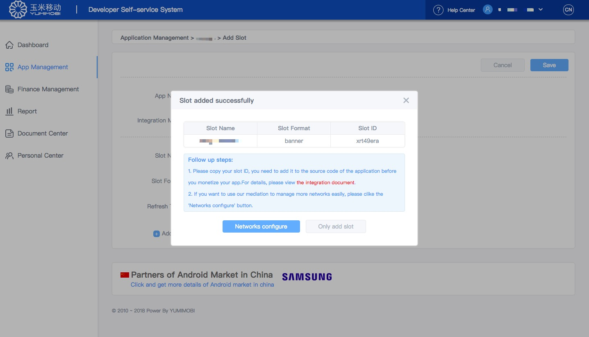
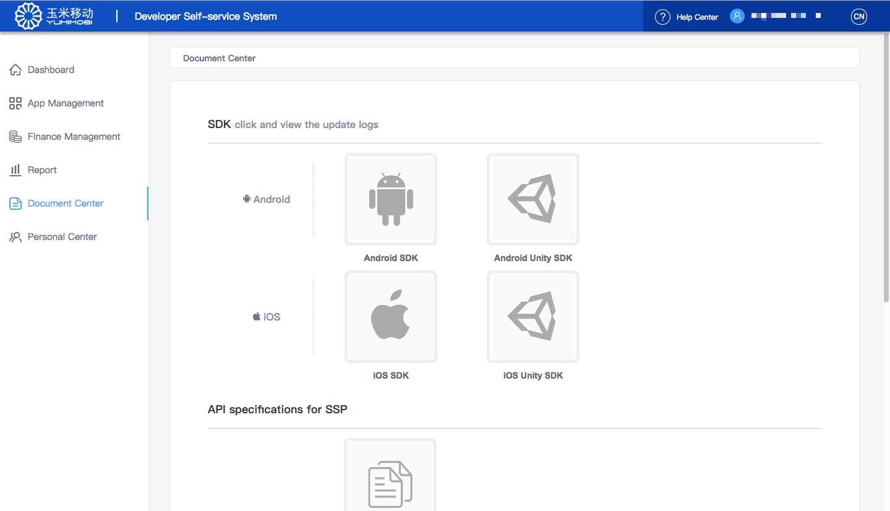
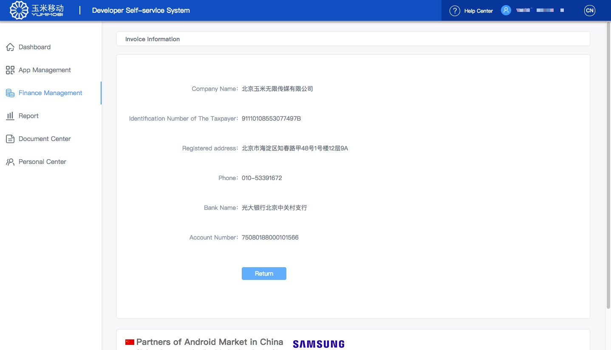
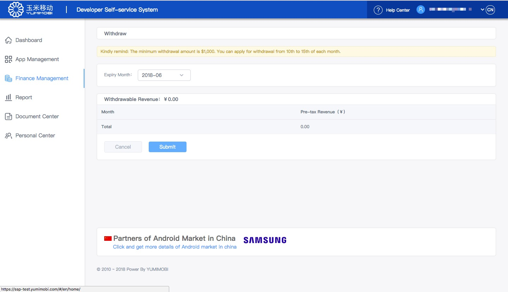

### Instructions for developer system

## 1. Dashboard
 The home page displays the last 7 days' data by default. The developer can view the display and income of the last 7 days.

## 2. App Management
### 2.1 App Management
All app information taht developer created will be shown on this page. After the app is created, there is a review cycle. Only after it is approved can the traffics be realized. 

### 2.2 Add New App
Step 1:  Click on the 'add appication' button and enter the interface of app creation. Fill in the fundemental information of app and save it, then enter the page of slot creation; the integration mode of app is the same to the one of account and both of them wil not be edited.

  1). When the market for app is App Store or Google play: fill in the market URL to pick up the information of pakage name and app name.If the app had updated in app store,click 'Please click here to renew the APP information if the APP is online' to renew the app's latest information.
   
  2). If the market for app is domestic android market, or the app is not online in App Store or Google play: click 'If the APP is not online, click here to fill in the APP information.'to fill in the fundemental information of app ;fill in the fundemental information of app .

Step 2：Save the information of app craetion and enter the page of slot creatinon,then fill in slot name and select the type of slot.

Step 3：There is a relevant slot ID taht you need to add to your app's source code after saving slot information. When the app is apploved and its slot is turn on, ad request and filling will be normally granted so as to realize the traffic qulidity function.

Step 4：Networks function：
Filling effect and traffic qulidity capacity can be better improved by networks function; developer should apply for account on third-part platformt under networks to pick up relevant parameters; ad request is granted according to developer's configured information after configuration is saved.
 - Under the satatue of automatic configuration or manual configuration, platform is open on the base of completed ad paremeters. 
 - By clicking on platform name, you can fill in revelant parameters which are required options;ad paremeters are used for ad request,incorrect ad paremeters will cause request failed;report api paremeters are used for platform's statistics,please fill in correctly or the statistics will not be recieved and the effect of automatic order will be affected.

## 3. Document Center
- Developer can receive the SDK & SSP API intergraiton document of Yumi platform in document center after creating app successfully, and intergrate it to realize traffic liquidity; developer can receive specific Yumi statistics by means of report api intergration document.

## 4. Finnance Management
#### 1. Finnance list
- Developer can check more specific information about finnance instructions, finnance informations,invoice information,monthly revenue records and withdrawable records on the page of finnance management.

### 2. Add finnance fundemental information
1). Only fills in finnance information successfully can developer proceed to withdrawable procedures.
2). Developer must fill in raeal finnance information which can not be changed as finnance transfer account.
- When it is a personal account, invoice information is not necessary. In this case, developer's relevant tax administration is withheld by Yumimobi,so it requires to upload ID card information; when it is a company account,invoice information is necessary and relavnat credentials prove of company are requiered to filled in.

### 3. Invoice materials
When company draws a invoce, click on finnance managment>invoice meterials to check invoice information.

### 4. Withdraw
- Withdraw：total revenue can be withdrawn once or spearatly before deadline,developer can check the submitted information on withdrawable managment page.
 

## 5. Report
1. All statistics and currencies are base on the settlement currencies when registered, and coverted and estimated in accordance of exchange rate.
2. Statisticl trend graph：
- All networks related to apps show nearly one month (customizable date) statistics trend graph by default, and the three table keys of revenue, impression, eCPM can be switched;
- Platform respectively shows the trend graph of revenue, impression, eCPM over a period of time;
- If the networks is not configured, there only shows the statistics from Yumi platform.

3. List page dispalys statistics according to 7 dimensions of apps, days, slot formats, markets in china, countries and netwoks;
- Above 5 dimensions of apps, days, slot formats, markets in china and countries only display the statistics from Yumi platform；
- Networks display the statistics of third-party platform through report api parameters.
- Each dimension corresponds to one export, click the corresponding export button to export the corresponding report statistics.
 

## 6. Personal Center
- Click the personal center, then enter the page of personal center where shows the information you filled in at the time of registration.

## 7.Partners of Android Market in China
- Some of Android Market in china have cooperated with YUMI platform about how to help developer to distribute their applications in China. We provide an efficient, simple and new way to help you. You just need set the value of setChannelID(channelStr) to ChannelID which is on behalf of Android market when you integrating YUMI SDK to your applications. YUMI platform will automatically complete attribution analysis for developer and Android market.
  

